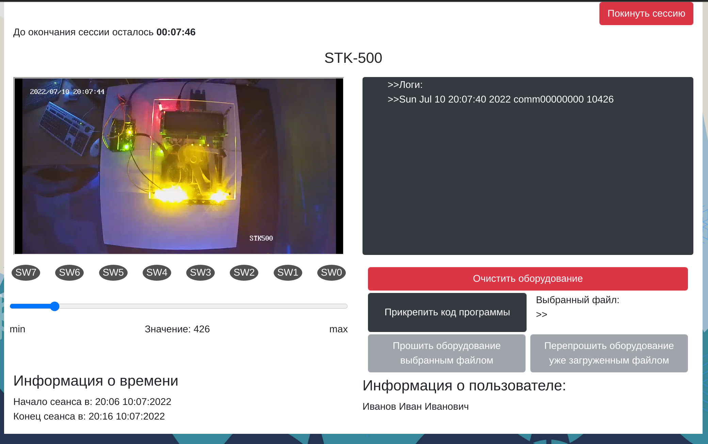

<h1>Angular SPA</h1>

The client application of the remote access service to the equipment. Basic functionality of UI:

- connecting to sessions and working with the appropriate microcontroller;
- organization of users into groups for booking equipment and logging with ratings;
- booking sessions by users;

General scheme of the web application

Demonstration session with the STK-500 board

<h2>Relative links</h2>

- laboratory stand server (https://github.com/KSergey-web/lab-server);
- intermediary server (https://github.com/KSergey-web/server-intermediary-sfu);
- main server based on CMS Straps (https://github.com/KSergey-web/hardware-sfu-online);
- Angular SPA app (https://github.com/KSergey-web/hardware-client);

Third-party software:

- video stream server (https://github.com/aler9/rtsp-simple-server);

# HardwareClient

This project was generated with [Angular CLI](https://github.com/angular/angular-cli) version 12.2.13.

## Development server

Run `ng serve` for a dev server. Navigate to `http://localhost:4200/`. The app will automatically reload if you change any of the source files.

## Code scaffolding

Run `ng generate component component-name` to generate a new component. You can also use `ng generate directive|pipe|service|class|guard|interface|enum|module`.

## Build

Run `ng build` to build the project. The build artifacts will be stored in the `dist/` directory.

## Running unit tests

Run `ng test` to execute the unit tests via [Karma](https://karma-runner.github.io).

## Running end-to-end tests

Run `ng e2e` to execute the end-to-end tests via a platform of your choice. To use this command, you need to first add a package that implements end-to-end testing capabilities.

## Further help

To get more help on the Angular CLI use `ng help` or go check out the [Angular CLI Overview and Command Reference](https://angular.io/cli) page.
